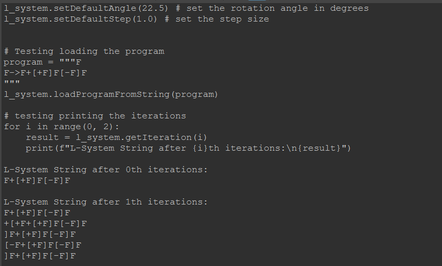

# Part 1
## Section 1.1  and 1.2
Successfully wrapped the C++ class that can instantiated, called, and
run in python program

# Part 2
## Part 2.1
Testing the Flower grammar

# Part 3
## Part 3.1
Creation of Random Node (connect to an instancer for testing)

## Part 3.2
Creation of the L-System Instancer Node